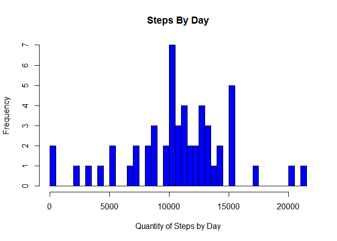
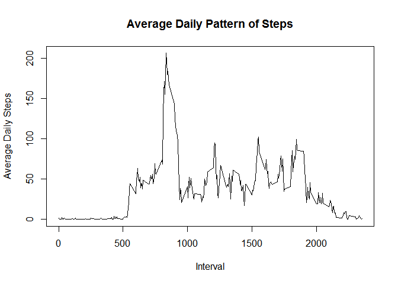
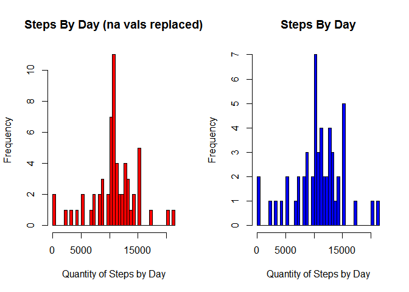
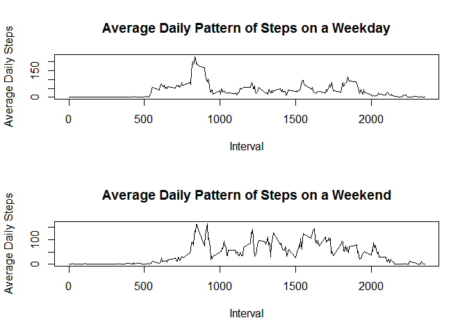

# Reproducible Research: Peer Assessment 1


## Loading and preprocessing the data
First the csv has to be unzipped and turned into a data.table.
The date column is converted to date objects, and two tables are set up, 
one with NA vals and one without.

```r
unzip("activity.zip")
library(data.table)
actDat <- data.table(read.csv("activity.csv"))
actDat$date <- as.Date(actDat$date)
missingRows <- length(which(is.na(actDat)))
actDatImputed <- actDat
#remove NA
actDat <- na.omit(actDat)
```


## What is mean total number of steps taken per day?
First lets graph steps by day in a histogram.

```r
sumSteps <- actDat[,list(sumSteps=sum(steps)),by=date]
hist(sumSteps$sumSteps,
     breaks=length(sumSteps$sumSteps),
     xlab="Quantity of Steps by Day",
     main="Steps By Day",
     col="blue")
```



```r
meanStepsPerDay <- mean(sumSteps$sumSteps)
paste("Mean steps per day ",meanStepsPerDay) 
```

```
## [1] "Mean steps per day  10766.1886792453"
```

```r
medianStepsPerDay <- median(sumSteps$sumSteps)
paste("Median steps per day ",medianStepsPerDay)
```

```
## [1] "Median steps per day  10765"
```

## What is the average daily activity pattern?
Lets graph the average number of steps per interval, for all days.

```r
meanByInterval <- actDat[,list(meanSteps=mean(steps)),by=interval]
plot(meanByInterval$meanSteps~meanByInterval$interval,
     type="l",
     xlab="Interval",
     ylab="Average Daily Steps",
     main="Average Daily Pattern of Steps")
```


<br>
The interval containing the largest average of daily steps is 835.
Since each interval is 5 minutes, that would be at 8:40 AM

```r
which(meanByInterval$meanSteps == max(meanByInterval$meanSteps))
```

```
## [1] 104
```

```r
meanByInterval$interval[104]
```

```
## [1] 835
```
## Imputing missing values
The number of rows missing data is:

```r
missingRows
```

```
## [1] 2304
```
To compensate for missing values, missing values will be
replaced with the mean of that 5 minute interval across days.


```r
#actDatImputed is the data with na values
#loop over actDatImputed, replace na steps with equivalent average from
#meanByInterval, which is average steps of days, by interval
for (x in 1:length(actDatImputed$steps)) {
  if (is.na(actDatImputed$steps[x])) {
    interval <- actDatImputed$interval[x]
    r <- which(meanByInterval$interval == interval)
    actDatImputed$steps[x] <- meanByInterval$meanSteps[r]
  }
}
head(actDatImputed)
```

```
##        steps       date interval
## 1: 1.7169811 2012-10-01        0
## 2: 0.3396226 2012-10-01        5
## 3: 0.1320755 2012-10-01       10
## 4: 0.1509434 2012-10-01       15
## 5: 0.0754717 2012-10-01       20
## 6: 2.0943396 2012-10-01       25
```
Now the average daily steps is recomputed with na values replaced.

```r
par(mfrow=c(1,2))
meanByIntervalImputed <- actDat[,list(meanSteps=mean(steps)),by=interval]
sumStepsImp <- actDatImputed[,list(sumSteps=sum(steps)),by=date]
hist(sumStepsImp$sumSteps,
     breaks=length(sumSteps$sumSteps),
     xlab="Quantity of Steps by Day",
     main="Steps By Day (na vals replaced)",
     col="red")
hist(sumSteps$sumSteps,
     breaks=length(sumSteps$sumSteps),
     xlab="Quantity of Steps by Day",
     main="Steps By Day",
     col="blue")
```


<br>
Distribution does not appear to change after replacing na values.
Now let us compare mean and median:

```r
meanStepsPerDay <- mean(sumSteps$sumSteps)
medianStepsPerDay <- median(sumSteps$sumSteps)
meanStepsPerDayImp <- mean(sumStepsImp$sumSteps)
medianStepsPerDayImp <- median(sumStepsImp$sumSteps)
paste("Mean steps per day ",
      meanStepsPerDay,
      " Mean steps per day (na replaced) ",
      meanStepsPerDayImp)
```

```
## [1] "Mean steps per day  10766.1886792453  Mean steps per day (na replaced)  10766.1886792453"
```

```r
paste(" Median steps per day ",
      meanStepsPerDayImp,
      " Median steps per day (na replaced) ",
      medianStepsPerDayImp)
```

```
## [1] " Median steps per day  10766.1886792453  Median steps per day (na replaced)  10766.1886792453"
```
Mean and median are not affected by the replacement of na values.
## Are there differences in activity patterns between weekdays and weekends?
Using the NA replaced data, let us look at the difference between weekday and weekend activity.


```r
weekendActivityVals <- weekdays(actDatImputed$date) == "Sunday" |
                   weekdays(actDatImputed$date) == "Saturday"

weekdayActivity <- subset(actDatImputed,!weekendActivityVals)
weekendActivity <- subset(actDatImputed,weekendActivityVals)

weekdayMean <- weekdayActivity[,list(meanSteps=mean(steps)),by=interval]
weekendMean <- weekendActivity[,list(meanSteps=mean(steps)),by=interval]

par(mfrow=c(2,1))
plot(weekdayMean$meanSteps~weekdayMean$interval,
     type="l",
     xlab="Interval",
     ylab="Average Daily Steps",
     main="Average Daily Pattern of Steps on a Weekday")

plot(weekendMean$meanSteps~weekendMean$interval,
     type="l",
     xlab="Interval",
     ylab="Average Daily Steps",
     main="Average Daily Pattern of Steps on a Weekend")
```



It looks like there are differences between activity on the weekdays and weekend.
